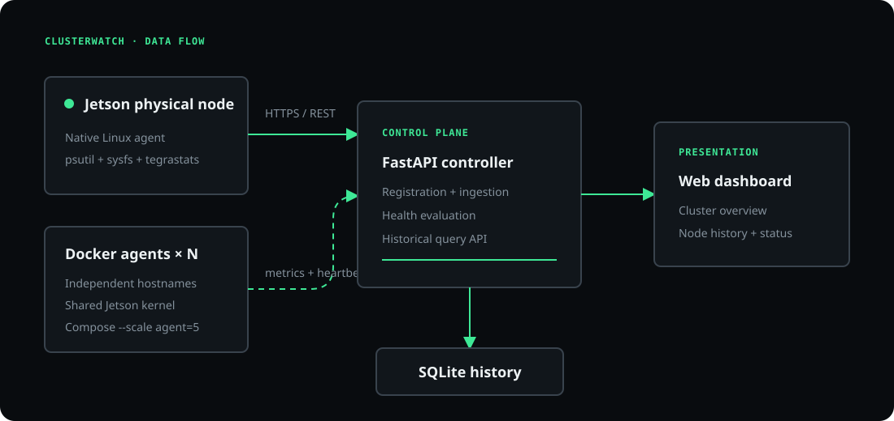
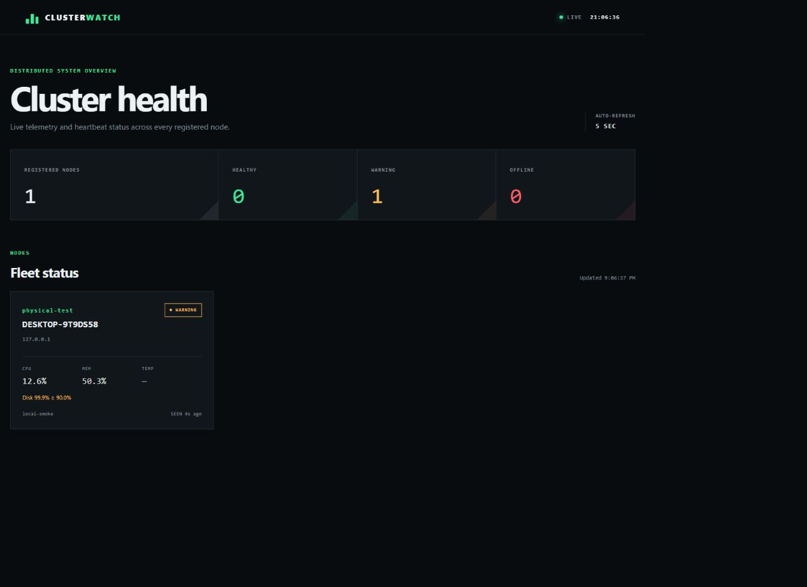
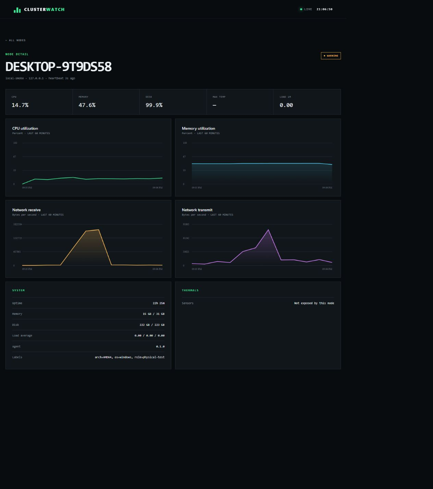

# ClusterWatch

**A lightweight distributed Linux monitoring platform for a real NVIDIA Jetson and a cluster of containerized nodes.**

[](https://github.com/TolgaBilgis/ClusterWatch/actions/workflows/test.yml)

ClusterWatch demonstrates the control-plane mechanics behind infrastructure monitoring: node registration, periodic telemetry, heartbeats, failure detection, health policy, time-series history, and a centralized dashboard. It is intentionally small enough to understand end-to-end and structured so the same agent can later run on additional physical Linux machines.



## What it does

- Runs a native agent on a Jetson for real host, thermal, and NVIDIA GPU telemetry.
- Scales containerized agents as simulated nodes with distinct IDs and network identities.
- Marks nodes `HEALTHY`, `WARNING`, or `OFFLINE` from controller-side evidence.
- Stores metric history in SQLite and exposes it through a documented FastAPI API.
- Shows a responsive cluster overview and per-node charts, with no frontend build step.
- Handles sensor failures separately from liveness: a failed collection sends a heartbeat carrying the error.
- Retries transient delivery failures with bounded exponential backoff and jitter.
- Optionally authenticates agent writes with a shared API key.

## Dashboard

The dashboard is available at `http://localhost:8000` after startup. It refreshes every five seconds and includes cluster-wide status counts, per-node summary cards, one-hour CPU/memory/network charts, disk usage, load average, uptime, labels, sensor temperatures, and Jetson GPU readings.





These screenshots come from a local smoke test. Replace them with a populated Jetson-plus-containers run before publishing for stronger portfolio evidence.

## Architecture

```text
Jetson agent ─────┐
                  ├── REST metrics / heartbeat ──> FastAPI controller ──> SQLite
Docker agent × N ─┘                                      │
                                                        └── Dashboard + REST API
```

Each agent chooses a stable `node_id`, registers metadata and capabilities, and pushes a metric sample on a configurable interval. The controller records its own receipt time, so agent clock drift cannot keep a dead node online. A metric submission is also a heartbeat. If collection itself fails, the agent sends the dedicated heartbeat endpoint with a bounded error message.

Status is evaluated when the API is read:

1. `OFFLINE` if the controller has not received a heartbeat within the timeout.
2. `WARNING` if the newest sample crosses a configured threshold, the agent reported a collection error, or no sample exists yet.
3. `HEALTHY` otherwise.

This avoids a per-node timer and ensures status is derived consistently after controller restarts.

## Quick start: simulated cluster

Requirements: Docker Engine with the Compose plugin.

```bash
git clone https://github.com/TolgaBilgis/ClusterWatch.git
cd clusterwatch
docker compose up --build --scale agent=5
```

Open [http://localhost:8000](http://localhost:8000). The OpenAPI explorer is at [http://localhost:8000/docs](http://localhost:8000/docs).

To test failure detection, list the containers and stop one agent:

```bash
docker compose ps
docker stop <one-agent-container-name>
```

After `CW_OFFLINE_TIMEOUT_SECONDS` (15 seconds by default), that node changes to `OFFLINE`. Start the container again and it re-registers and recovers automatically.

Compose intentionally does not set `container_name`; Docker assigns every scaled agent a unique hostname, which becomes its default node ID. All simulated agents ultimately share the Jetson kernel and hardware. They validate distributed coordination and failure handling—not performance scaling.

## Add the physical Jetson agent

Run the controller and simulated agents with Docker, then run one agent **on the Jetson host**. A host process has the cleanest access to `/sys` thermal sensors and `tegrastats`.

```bash
python3 -m venv .venv
source .venv/bin/activate
pip install -e .

export CW_CONTROLLER_URL=http://127.0.0.1:8000
export CW_NODE_ID=jetson-main
export CW_NODE_LABELS=role=physical,accelerator=jetson
export CW_ENABLE_JETSON_TELEMETRY=true
export CW_API_KEY=replace-with-a-long-random-value
clusterwatch-agent
```

For another physical Linux machine, install the same package, set `CW_CONTROLLER_URL` to the Jetson's LAN address (for example `http://192.168.1.20:8000`), choose a unique node ID, and start `clusterwatch-agent`. No controller change is required.

### Jetson telemetry behavior

The collector uses layers of best-effort detection:

1. Standard Linux metrics from `psutil`.
2. Temperatures from `psutil` or `/sys/class/thermal`.
3. Jetson GPU load from the NVIDIA sysfs interface when present.
4. GPU utilization and temperature parsed from `tegrastats` when it is on `PATH`.

Non-Jetson Linux hosts and containers simply return an empty GPU object. Missing vendor telemetry never prevents ordinary metrics from being reported.

## Configuration

Copy `.env.example` to `.env` to customize Compose. Every setting is an environment variable.

| Variable | Default | Used by | Purpose |
|---|---:|---|---|
| `CW_CONTROLLER_URL` | `http://127.0.0.1:8000` | agent | Controller base URL |
| `CW_NODE_ID` | hostname | agent | Stable, unique node identity |
| `CW_NODE_LABELS` | empty | agent | Comma-separated `key=value` metadata |
| `CW_SAMPLE_INTERVAL_SECONDS` | `5` | agent | Collection and delivery interval |
| `CW_ENABLE_JETSON_TELEMETRY` | `true` | agent | Enable NVIDIA Jetson probes |
| `CW_DELIVERY_MAX_ATTEMPTS` | `4` | agent | Maximum attempts for each registration or delivery |
| `CW_DELIVERY_RETRY_BASE_SECONDS` | `0.5` | agent | Initial retry delay before exponential growth |
| `CW_DELIVERY_RETRY_MAX_SECONDS` | `5` | agent | Upper bound for each retry delay |
| `CW_DELIVERY_RETRY_JITTER` | `0.2` | agent | Random delay variation from `0` to `1` |
| `CW_API_KEY` | unset | both | Shared key required for agent write requests when set |
| `CW_DATABASE_PATH` | `./data/clusterwatch.db` | controller | SQLite database file |
| `CW_OFFLINE_TIMEOUT_SECONDS` | `15` | controller | Missed-heartbeat deadline |
| `CW_CPU_WARNING_PERCENT` | `85` | controller | CPU warning threshold |
| `CW_MEMORY_WARNING_PERCENT` | `85` | controller | RAM warning threshold |
| `CW_DISK_WARNING_PERCENT` | `90` | controller | Disk warning threshold |
| `CW_TEMPERATURE_WARNING_C` | `80` | controller | Sensor/GPU warning threshold |
| `CW_HISTORY_RETENTION_DAYS` | `7` | controller | Metric retention window |

A practical rule is to keep the offline timeout at least two or three times the sample interval to avoid false positives during brief scheduling or network delays.

Agents retry connection failures, timeouts, HTTP `408`, `425`, `429`, and server errors. Other client errors fail immediately. The retry count is bounded per sample so a prolonged outage does not block fresh telemetry forever; after the attempts are exhausted, the regular sampling loop continues.

### Agent authentication

Authentication is disabled when `CW_API_KEY` is unset, preserving the default trusted-LAN setup. To enable it, generate a strong random value and set the same `CW_API_KEY` on the controller and every agent. Compose passes the value to both services from `.env`:

```bash
python3 -c 'import secrets; print(secrets.token_urlsafe(32))'
```

When enabled, registration, metric, and heartbeat requests must include the key in the `X-ClusterWatch-Key` header. Read-only dashboard routes and `/health` remain public. Treat the key as a secret: do not commit a populated `.env` file, and use TLS or a trusted private network because the header itself is not encrypted.

## API

| Method | Route | Purpose |
|---|---|---|
| `POST` | `/api/v1/nodes/register` | Register or refresh agent metadata |
| `POST` | `/api/v1/nodes/{id}/metrics` | Store a sample and update heartbeat |
| `POST` | `/api/v1/nodes/{id}/heartbeat` | Preserve liveness after collection failure |
| `GET` | `/api/v1/nodes` | Cluster summary and latest samples |
| `GET` | `/api/v1/nodes/{id}` | Node status and current data |
| `GET` | `/api/v1/nodes/{id}/metrics` | Bounded historical series |
| `GET` | `/api/v1/config` | Public health-policy configuration |
| `GET` | `/health` | Controller health probe |

FastAPI generates the exact schemas and an interactive client at `/docs`.

## Local development and tests

```bash
python3 -m venv .venv
source .venv/bin/activate
pip install -e ".[dev]"
pytest --cov=clusterwatch --cov-report=term-missing
```

Run the services without Docker in two terminals:

```bash
clusterwatch-controller
CW_NODE_ID=local-dev clusterwatch-agent
```

The tests cover registration, ingestion, chronological history, threshold warnings, heartbeat fallback, Jetson GPU temperature policy, and missed-heartbeat offline transitions. GitHub Actions runs the suite on every push and pull request.

## Repository layout

```text
clusterwatch/
├── agent/          # collection, Jetson probes, registration, delivery loop
├── controller/     # FastAPI routes, health policy, SQLite repository
├── dashboard/      # dependency-free HTML/CSS/JavaScript UI
├── schemas.py      # shared wire contracts
└── config.py       # environment-based settings
tests/              # API, policy, and telemetry tests
docker-compose.yml  # controller plus horizontally scalable agents
```

## Engineering choices and tradeoffs

- **Push instead of scrape:** agents work across simple networks and naturally carry registration metadata. A future Prometheus endpoint can coexist with this protocol.
- **SQLite first:** WAL mode and a narrow repository layer are enough for one controller and a small cluster. The storage boundary makes PostgreSQL a contained future change.
- **Controller receipt time for liveness:** avoids trusting node clocks for failure detection. `collected_at` is retained for chart chronology.
- **Polling dashboard:** five-second polling is reliable and inspectable. WebSockets are useful later, but not required for the MVP's data volume.
- **One agent artifact:** physical nodes and simulated nodes run the same code. Jetson probes are capability-detected extensions, not a separate agent fork.
- **Optional shared-key authentication:** one key keeps small trusted clusters simple, while leaving room for per-node identities later. Do not expose port 8000 to the public internet without TLS.

## Portfolio demo checklist

1. Start five simulated nodes and the physical Jetson agent.
2. Show the cluster overview and Jetson GPU/thermal fields.
3. Apply load to one node and explain threshold-derived `WARNING` state.
4. Stop an agent container and watch it become `OFFLINE` after the deadline.
5. Restart it and show automatic recovery plus retained history.
6. Walk through the shared schema, controller-owned timestamps, SQLite index, and graceful vendor-telemetry fallback.

## Sensible next steps

Good extensions, in order of increasing operational scope: Prometheus export, WebSocket updates, authenticated agents, alert delivery, PostgreSQL, Ansible installation, and Kubernetes manifests. Benchmarking and scheduler integrations should come only after the monitoring path is stable; ClusterWatch is a credible control-plane project without pretending container replicas provide real HPC scaling.

## License

MIT — update the copyright notice before publishing.
